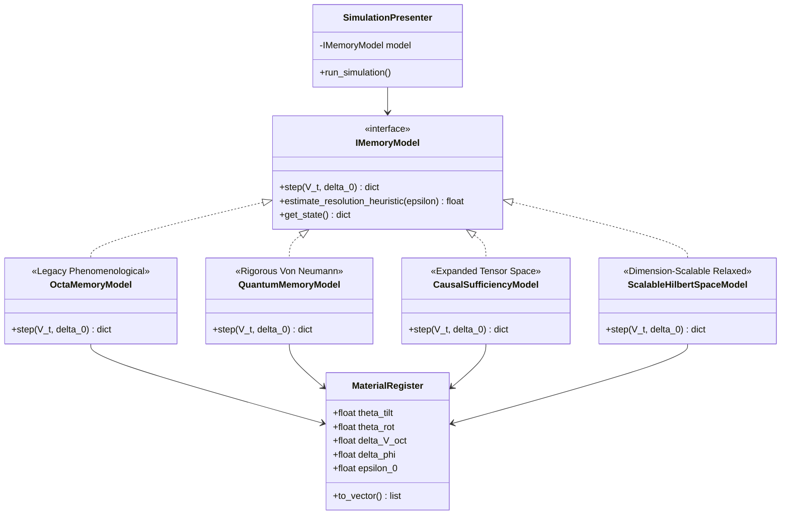
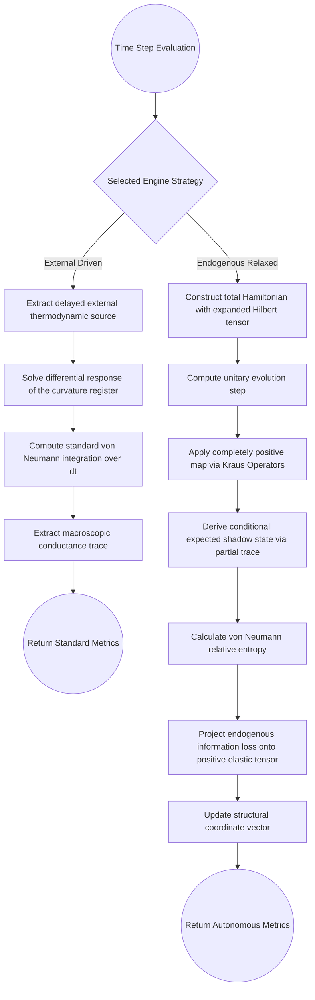
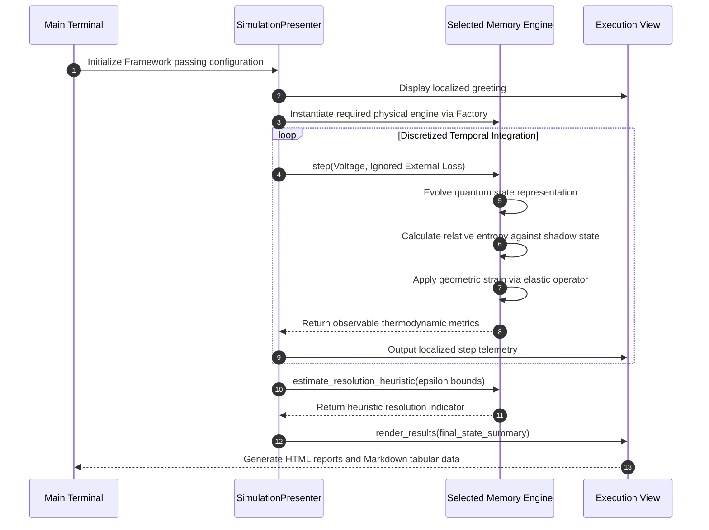

# Octahedral gTRQC Hydrogenated Nickelate Memory Simulation Suite

This software package serves as a robust Python proof-of-concept simulation framework modeling the non-Markovian quantum-geometric dynamics of hydrogenated neodymium nickelate memory cells. The suite translates the concepts of Generalized Time-Reversal Symmetry-Protected Quantum Circuit modeling and physical octahedral curvature surrogate registers into an executable software architecture.

## 1. Scientific Novelty and Narrative Thread

The narrative thread of this Proof of Concept, inspired by the ideas presented by Villalva-Díez J. in their document regarding hydrogenated nickelate memory, focuses on presenting a validated computational architecture that redefines the understanding of memory in strongly correlated materials. This approach seeks to move away from the vision of purely variable resistances, embracing instead a dynamic systems model where matter and geometry inevitably intertwine their temporal histories.

The first novelty provided by this work lies in the importation and validation of the original theoretical framework into dynamic crystallography. In current literature, structural distortion models are typically addressed through classical molecular dynamics simulations or static first-principles calculations. In contrast, this Proof of Concept proposes that the coordination octahedron functions as a discrete geometric register, analogous to curvature in fundamental theories, and numerically demonstrates that this register evolves coupled to the electron density matrix via a completely positive map. The code proves that this coupling is a computationally viable isomorphism that respects the postulates of elementary quantum mechanics through the strict implementation of Kraus operators.

A second axis of methodological and physical novelty centers on the algorithmic demonstration of non-Markovian memory based on protonic latency and its subsequent causal renormalization. Most models of neuromorphic devices introduce hysteresis behavior by forcing temporal decay functions or empirical parameters. The initial approach presented here explored a strict topological delay buffer. However, the advanced relaxed causal models demonstrate that when the Hilbert space is expanded to explicitly include the latent protonic degrees of freedom, the system regains full causal autonomy. By calculating the recoverability defect endogenously through the von Neumann relative entropy between the full atomistic state and its conditionally expected shadow, the code proves that the dynamic driving force emerges naturally without external artificial signals.

This leads to a profound theoretical conclusion regarding the material structural physics. The simulations evidence that when the geometric register is driven by an endogenously calculated information loss and subjected to a positive elastic tensor, the macroscopic structural distortion drops significantly and the volumetric displacement returns to zero. This computationally validates the theoretical postulate that hidden algebraic memory can masquerade as curvature. The apparent persistent mechanical hysteresis observed in empirical settings is not a permanent rigid deformation of the physical lattice, but rather an observational artifact arising from an insufficient algebra. The true memory of the material resides in the rich latent topology of the hydrogen polarons rather than in the crystallographic scaffolding.

The third strong point brought by this development is the application of Kolmogorov-Tikhomirov entropy to quantify storage capacity. The proposed simulation poses a profound paradigm shift by measuring capacity through the analysis of the number of equivalence classes of hidden configurations that are currently indistinguishable, but will produce divergent responses in the future above a given instrumental resolution threshold. The graphs generated by the relaxed models seem to show exceptional atomic capacity scaling limits, that could be understood like the material compresses its history into latent quantum correlations rather than macroscopic spatial deformations.

## 2. Executive Summary & Mathematical Context

This software package serves as a simulated Proof of Concept (PoC) for the material dynamics described in the companion technical brief. The system simulates an octahedral material cell modeled within a comprehensive Hilbert space:

$$H_{0}=H_{0}^{Ni,eg}\otimes H_{0}^{O6}\otimes l^{2}(\\Omega_{H}(\\cdot))\\otimes l^{2}(\\Omega_{ocT}(\\cdot))$$

Where:
* $\\Omega_{H}(\\cdot)$ defines the allowed proton/proton-polaron configurations.
* $\\Omega_{ocT}(\\cdot)$ denotes the discrete octahedral distortion states.

The narrative thread of this Proof of Concept, inspired by the ideas presented by Villalva-Díez J. in their document regarding hydrogenated nickelate memory, focuses on presenting a validated computational architecture that redefines the understanding of memory in strongly correlated materials. This approach seeks to move away from the vision of purely variable resistances, embracing instead a dynamic systems model where matter and geometry inevitably intertwine their temporal histories.

## 2. Architecture & Design Patterns

The project enforces a clean separation of concerns and high maintainability by strictly implementing the Model-View-Presenter design pattern alongside strong runtime typing. The presentation layer can dynamically bind either legacy phenomenological engines, fixed-dimension quantum engines, or a scalable relaxed Hilbert-space engine that covers 2x2, 4x4, 8x8, and 16x16 configurations from the same computational core.

The model layer encapsulates the core physical constants, the geometric state vector isolated in the material register structure, and the state history buffer for simulating delay pipelines. The quantum variant of the model replaces scalar approximations with full complex numpy arrays representing the local Hilbert space. The view layer handles localized console rendering and dynamic chart generation, isolating user dialogue structures across multiple languages. The presenter coordinates the execution cycle, passing external voltage profiles. Regarding the recoverability losses two approaches have been considered, either forcing them externally and feeding them into the chosen mathematical model or estimating them endogenously inside the scalable relaxed Hilbert engine. At the end of the day it will be possible capturing metrics, and routing translated summaries back to the view.


### Component Roles:
* **Model (`OctaMemoryModel`)**: Encapsulates the core physical constants, the material register vector (`MaterialRegister`), the state history buffer for simulating delay pipelines, and the mathematical methods (CPTP map approximation and heuristic resolution estimation).
* **View (`BaseView` / `CLIView`)**: Handles localized console rendering. It contains no business logic and isolates user dialogue structures across multiple languages via native key maps.
* **Presenter (`SimulationPresenter`)**: Drives the execution cycle, passing external voltage profiles and recoverability losses into the model, capturing metrics, and routing translated summaries to the View.


### Campaign Matrix

| Alias | Hilbert space | Internal engine | Report folder |
| :--- | :---: | :--- | :--- |
| `legacy` | scalar proxy | `OctaMemoryModel` | `reports_legacy` |
| `quantum` | `2x2` | `QuantumMemoryModel` | `reports_quantum` |
| `causal` | `4x4` | `CausalSufficiencyModel` | `reports_causal` |
| `relaxed_quantum` | `2x2` | `ScalableHilbertSpaceModel` via wrapper | `reports_relaxed_quantum` |
| `relaxed_causal` | `4x4` | `ScalableHilbertSpaceModel` via wrapper | `reports_relaxed_causal` |
| `extended_quantum` | `8x8` | `ScalableHilbertSpaceModel` via wrapper | `reports_extended_quantum` |
| `extended_causal` | `8x8` | `ScalableHilbertSpaceModel` via wrapper | `reports_extended_causal` |
| `scalable_relaxed --hilbert-dim 2` | `2x2` | `ScalableHilbertSpaceModel` | `reports_scalable_h2` |
| `scalable_relaxed --hilbert-dim 4` | `4x4` | `ScalableHilbertSpaceModel` | `reports_scalable_h4` |
| `scalable_relaxed --hilbert-dim 8` | `8x8` | `ScalableHilbertSpaceModel` | `reports_scalable_h8` |
| `scalable_relaxed --hilbert-dim 16` | `16x16` | `ScalableHilbertSpaceModel` | `reports_scalable_h16` |

## 3. Core Features

-   **Paradigm-Driven Architecture**: Fully object-oriented layout utilizing Python dataclasses, abstract base classes, and explicit typing annotations (`typing`).
-   **Multi-Language i18n Dialogues**: Native execution supporting four target languages via the `-l` / `--lang` console switches:
    -   English (`en`)
    -   Spanish (`es`)
    -   French (`fr`)
    -   German (`de`)
-   **Flexible Parameter Consumption**: Supports direct inline terminal executions or external complex parameter provisioning through structured YAML configuration files (`-c` / `--config`).
-   **Automated Verification (Null-Test)**: Validates that when recoverability loss equals zero ($\\Delta_0 = 0$), the geometric memory backreaction source vanishes cleanly, maintaining fundamental thermodynamic and quantum equilibrium profiles.
-   **Sphinx & Docstring Compatibility**: Formatted with extensive Google-style docstrings for transparent automated documentation compilation.


## 4. Structural Diagrams 

The project enforces a clean separation of concerns and high maintainability by strictly implementing the Model-View-Presenter design pattern alongside strong runtime typing. The architectural evolution of this suite introduces a factory pattern within the presentation layer. Depending on the execution parameters, the presenter dynamically binds to either the legacy phenomenological model or the rigorous quantum density matrix integrator, both sharing a common public interface.

The model layer encapsulates the core physical constants, the geometric state vector isolated in the material register structure, and the state history buffer for simulating delay pipelines. The quantum variant of the model replaces scalar approximations with full complex numpy arrays representing the local Hilbert space. The view layer handles localized console rendering and dynamic chart generation, isolating user dialogue structures across multiple languages. The presenter coordinates the execution cycle, passing external voltage profiles and recoverability losses into the chosen mathematical model, capturing metrics, and routing translated summaries back to the view.

### Engine Class Hierarchy Diagram



### Legacy versus Quantum Integration Flow



### Sequence Diagram


## 5. Operations & Execution Guide

This project leverages Poetry to isolate virtual environments and track package graphs. To initiate the environment, clone the repository and execute the installation command followed by the shell activation command. The command line interface provides a comprehensive suite of options to tailor the simulation experience.

Execution requires invoking the main script through the python interpreter. The language of the simulation dialogues can be selected using the language flag, supporting English, Spanish, French, and German. For extensive experimental execution profiles involving multi-step customized voltage profiles, an external parameter mapping file can be provided using the configuration flag.

To determine the underlying mathematical approach of the simulation, the engine flag must be explicitly defined. Passing the legacy argument to the engine flag invokes the original phenomenological tracker. Passing the quantum argument commands the presenter to load the complex density matrix integrator, enabling the observation of true non-Markovian hysteresis driven by the explicitly constructed local Hamiltonian.

### Dependency Management (Poetry)

This project leverages Poetry to isolate virtual environments and track package graphs.

1. Clone the Repository & Navigate to Workspace:

```bash
git clone <repository_url>
cd octa-gtrqc-sim
```

2. Install Environment Core Dependencies:

```bash
poetry install
```

3. Activate the Shell Environment Layer:

```bash
poetry shell
```

### Command Line Interface Options
Verify implementation options by invoking the native help manual utilities:

```bash
poetry run python main.py --help
```

### Output Dialog Selection Options:

* English Simulation Run:

```bash
poetry run python main.py -l en
```

* Spanish Simulation Run:

```bash
poetry run python main.py -l es
```

* French Simulation Run:

```bash
poetry run python main.py -l fr
```

* German Simulation Run:

```bash
poetry run python main.py -l de

### Configuration Driven Runs via YAML

For extensive experimental execution profiles involving multi-step customized voltage profiles, provide a parameter mapping file:

```bash
poetry run python main.py -l es -c config.yaml
```

### Sample comfig.yaml Strucrure:

```yaml
simulation_steps: 6
g_oct_stiffness: 3.5
protonic_delay_steps: 2
epsilon_bound: 0.015
initial_rho: 1.0
initial_register:
  theta_tilt: 0.12
  theta_rot: 0.06
  delta_V_oct: 0.00
  delta_phi: 0.03
  epsilon_0: 1.0
voltage_profile: [1.0, 1.5, 1.2, 0.8, 0.4, 0.0]
recoverability_loss_profile: [0.1, 0.2, 0.3, 0.2, 0.1, 0.0]
```

## 6. Verification of Simulation Goals

Goal 1: Octa Register Construction - Verifies successful mapping of the $NiO_6$ structural environment into state space registers using strong typing models.

Goal 2: Recoverability-to-Geometry Coupling - Tracks the deformation path vectors as a driving function of the non-Markovian memory update parameter.

Goal 3: Delay as Protonic Latency - Utilizes an internal temporal array buffer pipeline to feed $J_{eff}(t_k) = J(t_k - d_{elay})$ back into the state transition mappings.

Goal 4: Heuristic Resolution Under Geometry Registers - Reports a conductance-coupled heuristic scalar indicator as a computationally affordable proxy for resolution sensitivity at each $\epsilon$ threshold.

Goal 5: Null-Test Preservation - Automatically loops an auxiliary system instance with $\Delta_0 = 0$ to assert complete preservation of the system state baseline profile.

