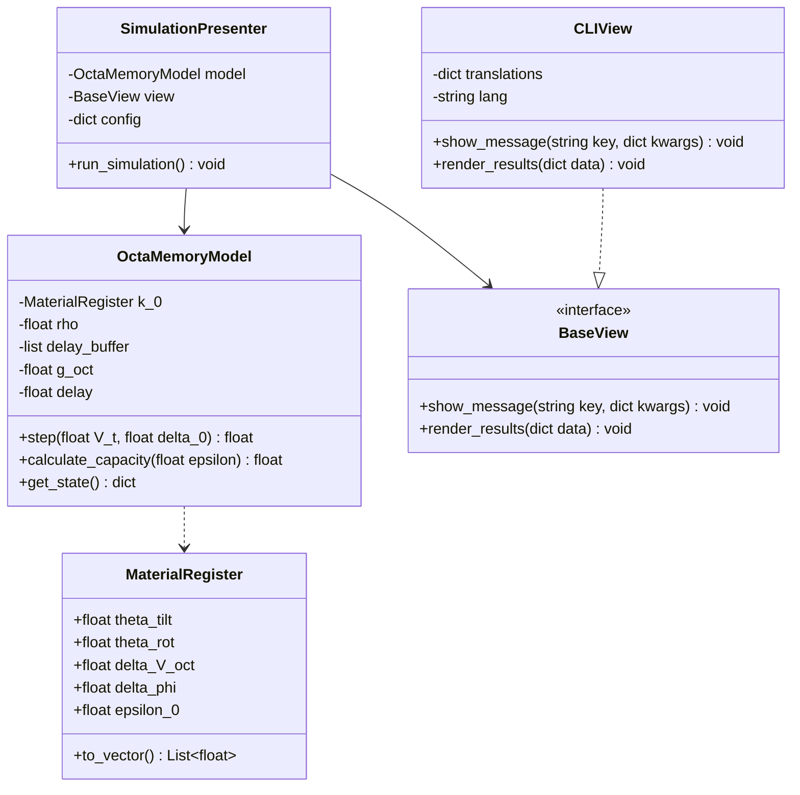
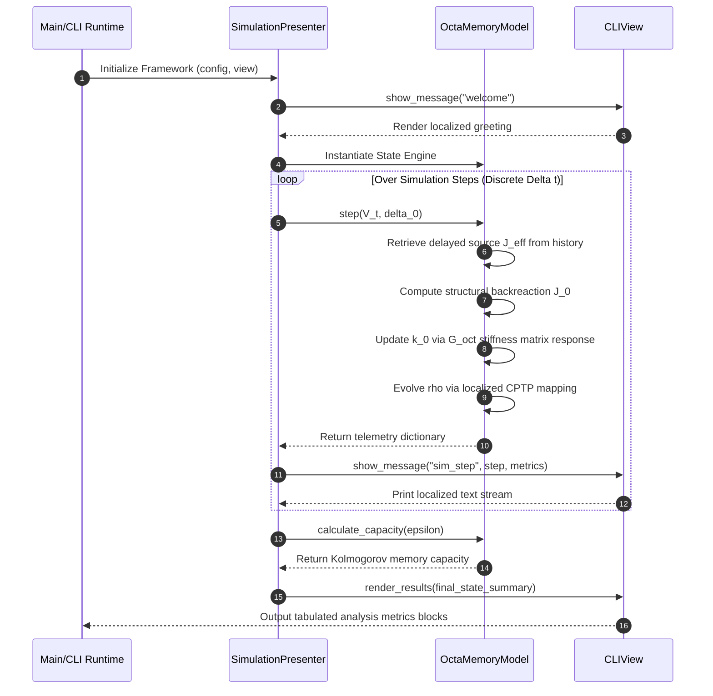

# Octahedral gTRQC Hydrogenated Nickelate Memory Simulation Suite

A robust, strongly typed Python proof-of-concept simulation framework modeling the non-Markovian quantum-geometric dynamics of hydrogenated neodymium nickelate ($H_xNdNiO_3$) memory cells. This suite translates the concepts of Generalized Time-Reversal Symmetry-Protected Quantum Circuit (gTRQC) modeling and physical octahedral curvature surrogate registers into an executable software architecture following the Model-View-Presenter (MVP) design pattern.

## 1. Executive Summary & Mathematical Context

This software package serves as a simulated Proof of Concept (PoC) for the material dynamics described in the companion technical brief. The system simulates an octahedral material cell modeled within a comprehensive Hilbert space:

$$H_{0}=H_{0}^{Ni,eg}\otimes H_{0}^{O6}\otimes l^{2}(\\Omega_{H}(\\cdot))\\otimes l^{2}(\\Omega_{ocT}(\\cdot))$$

Where:
* $\\Omega_{H}(\\cdot)$ defines the allowed proton/proton-polaron configurations.
* $\\Omega_{ocT}(\\cdot)$ denotes the discrete octahedral distortion states.

Each geometry state carries a finite vector register acting as the material analogue of a gTRQC curvature register:

$$k_{\\bullet}^{(a)}=(\\theta_{tilt}^{(a)}, \\theta_{rot}^{(a)}, \\delta V_{oct}^{(a)}, \\delta\\phi_{Ni-O-Ni}, \\epsilon_{0}^{(a)})$$

The execution loop tracks the material evolution under completely positive trace-preserving (CPTP) maps, influenced by a delayed backreaction source driven by a non-Markovian protonic/lattice latency parameter ($d_{elay}$).

## 2. Architecture & Design Patterns

The project enforces clean separation of concerns and high maintainability by strictly implementing the **Model-View-Presenter (MVP)** design pattern alongside strong runtime typing.

Salida de código

### Component Roles:
* **Model (`OctaMemoryModel`)**: Encapsulates the core physical constants, the material register vector (`MaterialRegister`), the state history buffer for simulating delay pipelines, and the mathematical methods (CPTP map approximation, Kolmogorov entropy limits).
* **View (`BaseView` / `CLIView`)**: Handles localized console rendering. It contains no business logic and isolates user dialogue structures across multiple languages via native key maps.
* **Presenter (`SimulationPresenter`)**: Drives the execution cycle, passing external voltage profiles and recoverability losses into the model, capturing metrics, and routing translated summaries to the View.

## 3. Core Features

-   **Paradigm-Driven Architecture**: Fully object-oriented layout utilizing Python dataclasses, abstract base classes, and explicit typing annotations (`typing`).
-   **Multi-Language i18n Dialogues**: Native execution supporting four target languages via the `-l` / `--lang` console switches:
    -   English (`en`)
    -   Spanish (`es`)
    -   French (`fr`)
    -   German (`de`)
-   **Flexible Parameter Consumption**: Supports direct inline terminal executions or external complex parameter provisioning through structured YAML configuration files (`-c` / `--config`).
-   **Automated Verification (Null-Test)**: Validates that when recoverability loss equals zero ($\\Delta_0 = 0$), the geometric memory backreaction source vanishes cleanly, maintaining fundamental thermodynamic and quantum equilibrium profiles.
-   **Sphinx & Docstring Compatibility**: Formatted with extensive Google-style docstrings for transparent automated documentation compilation.

---

## 4. Structural Diagrams (Mermaid)

### Class Diagram


### Sequence Diagram


## 5. Operations & Execution Guide

### Dependency Management (Poetry)

This project leverages Poetry to isolate virtual environments and track package graphs.

1. Clone the Repository & Navigate to Workspace:

```bash
git clone <repository_url>
cd octa-gtrqc-sim
```

2. Install Environment Core Dependencies:

```bash
poetry install
```

3. Activate the Shell Environment Layer:

```bash
poetry shell
```

### Command Line Interface Options
Verify implementation options by invoking the native help manual utilities:

```bash
poetry run python main.py --help
```

### Output Dialog Selection Options:

* English Simulation Run:

```bash
poetry run python main.py -l en
```

* Spanish Simulation Run:

```bash
poetry run python main.py -l es
```

* French Simulation Run:

```bash
poetry run python main.py -l fr
```

* German Simulation Run:

```bash
poetry run python main.py -l de

### Configuration Driven Runs via YAML

For extensive experimental execution profiles involving multi-step customized voltage profiles, provide a parameter mapping file:

```bash
poetry run python main.py -l es -c config.yaml
```

### Sample comfig.yaml Strucrure:

```yaml
simulation_steps: 6
g_oct_stiffness: 3.5
protonic_delay_steps: 2
epsilon_bound: 0.015
initial_rho: 1.0
initial_register:
  theta_tilt: 0.12
  theta_rot: 0.06
  delta_V_oct: 0.00
  delta_phi: 0.03
  epsilon_0: 1.0
voltage_profile: [1.0, 1.5, 1.2, 0.8, 0.4, 0.0]
recoverability_loss_profile: [0.1, 0.2, 0.3, 0.2, 0.1, 0.0]
```

## 6. Verification of Paper Simulation Goals

1: Goal 1: Octa Register Construction - Verifies successful mapping of the $NiO_6$ structural environment into state space registers using strong typing models.
2: Goal 2: Recoverability-to-Geometry Coupling - Tracks the deformation path vectors as a driving function of the non-Markovian memory update parameter.
3: Goal 3: Delay as Protonic Latency - Utilizes an internal temporal array buffer pipeline to feed $J_{eff}(t_k) = J(t_k - d_{elay})$ back into the state transition mappings.
4: Goal 4: Capacity Under Geometry Registers - Computes Kolmogorov-Tikhomirov $\epsilon$-entropy bounds using logarithmic classification tracking ($C_{atom}(\epsilon) = \log(N_\epsilon)$).
5: Goal 5: Null-Test Preservation - Automatically loops an auxiliary system instance with $\Delta_0 = 0$ to assert complete preservation of the system state baseline profile.
