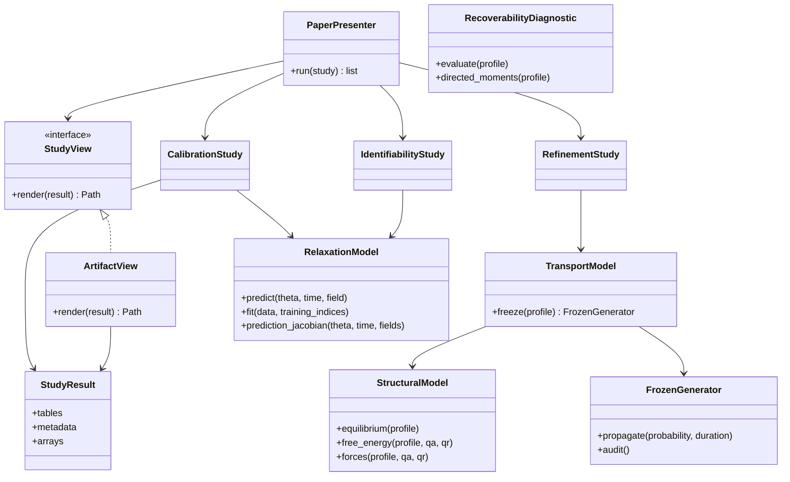
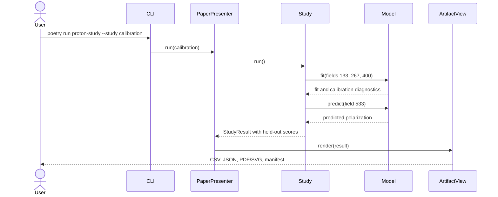

# Hx–NdNiO3: proton transport, polarization relaxation, and recoverability

This repository implements the reduced models in **Proton Transport and Polarization Relaxation in Hx–NdNiO3: Literature-Constrained Reduced Models and a Recoverability Diagnostic**. The paper-aligned implementation is `octa_gtrqc_sim.proton`, an object-oriented Python package organized using **Model–View–Presenter (MVP)**.

**Repository scope:** the current paper API, original notebook reference, and historical quantum-geometric prototypes are distinguished in [VARIANTS.md](VARIANTS.md). Historical engines are retained for compatibility and are not alternative implementations of the current paper.

The three scientific components have distinct roles:

- **Transport:** a one-dimensional, structure-conditioned, local-detailed-balance generator with a dimensioned two-mode structural free energy.
- **Relaxation:** a separately fitted phenomenological spectrum predicting normalized polarization, with the entire 533 kV/cm trace held out from primary calibration.
- **Recoverability:** an information-loss diagnostic under projection to mean occupancy. It does not enter structural forces, hopping rates, or the polarization readout.

The framework is modular. A dynamically calibrated concentration-to-polarization map is not implemented. Transferring the relaxation coefficient to the transport barrier is an explicit conditional hypothesis.

## Quick start with Poetry

Python 3.12 or later in the declared Poetry range is required. Dependencies are locked in `poetry.lock`.

```bash
poetry install
poetry run proton-study --study calibration
poetry run pytest -q
poetry run sphinx-build -b html -W --keep-going docs/source docs/_build/html
```

Open `docs/_build/html/index.html` to browse the documentation. Scientific runs work offline after installing dependencies: the 87 × 12 source-data matrix is packaged and checked by SHA-256.

## Reproduce the paper and review analyses

```bash
# Complete native campaign, including 100 bootstrap refits and all R2.5 profiles
poetry run proton-study --study all --output paper_results

# Individual studies
poetry run proton-study --study uncertainty
poetry run proton-study --study identifiability
poetry run proton-study --study review
poetry run proton-study --study start_sensitivity
poetry run proton-study --study transport_sensitivity
poetry run proton-study --study continuum
poetry run proton-study --study refinement
poetry run proton-study --study hidden_state

# Replay all four original notebooks, including the full 80-gate v3.1 record
poetry run proton-reference --output reference_results
```

Each native study writes CSV tables, JSON metadata, a SHA-256 manifest, a README, and relevant NPZ arrays and PDF/SVG figures. Notebook replay writes executed copies in separate directories and preserves the original notebook files byte for byte. Development dependencies provide Jupyter execution; native studies do not depend on Jupyter.

The full campaign can take several minutes. For a smaller identifiability run, use `--original-profile-only`. The full R3 audit uses reference meshes of 4096 and 8192 cells; smaller references change the numerical experiment and must be labelled accordingly. The default scientific seed is retained from the notebooks.

| Supplied notebook | Native implementation | Full source record |
| --- | --- | --- |
| `Hx_NdNiO3_single_cell_evidence_calibrated_PoC_v3_1.ipynb` | Structural and transport models, calibration, uncertainty, continuum, recoverability | Original 80-gate audit, synthetic risk/transfer ensembles, hidden-twin sensor design, structural evidence and visualizations via `proton-reference` |
| `proton_review_addendum.ipynb` | Retrospective field folds, biexponential comparator, information criteria, start sensitivity, independent transport sweep | Archived notebook replay |
| `proton_R2_5_identifiability.ipynb` | Analytic Jacobian, parameter correlation, original 31-point alpha profile and five nuisance profiles | Archived notebook replay |
| `proton_R3_full_generator_audit.ipynb` | Frozen full-generator refinement, gap/entropy checks and mesh-parity counterexample | Original audit-profile replay and original recorded-evidence figures |

The native `hidden_state` command is a small deterministic illustration, **not** a replacement for the notebook's larger synthetic risk and sensor-selection experiments. Original notebook terminology is preserved in the archive; current documentation follows the manuscript's more restricted interpretation.

## Architecture





No Model Context Protocol server is introduced: MVP is the architectural pattern used by the existing repository. The presenter and presentation-neutral results form a clean boundary for an optional future adapter.

## Scientific scope and regression targets

The native regression checks target cage stiffness **10.3784 eV/Ų**, breathing stiffness **36.6667 eV/Ų**, primary holdout **RMSE 0.026337** and **R² 0.990806**, and spectrum slope **alpha_A 6.52887**. The original accepted-grid interval is **[5.85566, 7.42649]**; extra nuisance-parameter profiles do not silently replace it.

Important distinctions are retained:

- The transport mesh represents coarse material volumes, not oxygen vertices of an octahedron.
- Alternating cell occupancy defines a mesh-dependent breathing proxy. R3 explicitly audits its refinement limitation; the gradient background is not assigned the constant-D benchmark's second-order claim.
- Frozen probability propagation establishes properties of a fixed linear generator. It does not prove nonlinear self-consistent occupancy stability or enforce an exclusion-process occupancy ceiling.
- The field-fold review is retrospective. When 533 kV/cm enters training for another fold, that result is separate from the primary holdout.
- Bootstrap bands and information criteria use the notebooks' working residual assumptions. Temporal correlation and unequal model flexibility limit mechanistic conclusions.
- Recoverability is diagnostic; it is not a source of mechanical force or proof of quantum storage capacity.

See [the reproducibility guide](docs/source/reproduction.rst), [model definitions](docs/source/paper_models.rst), and [verification record](validation/README.md).

## Documentation and GitHub Pages

Code uses English Google-style docstrings, rendered by Sphinx autodoc and Napoleon. Mermaid diagrams describe the architecture and scientific flow.

`.github/workflows/docs.yml` builds the documentation and runs tests on pull requests and branch updates. Deployment is enabled on the repository's default branch and manual dispatch **from that branch**. In GitHub, choose **Settings → Pages → Build and deployment → Source: GitHub Actions**. The workflow deploys a Pages artifact; it does not need to commit generated HTML to a `gh-pages` branch.

Expected project-site URL after deployment: <https://QC-UPM.github.io/OgTRQC/>. The workflow is prepared locally; successful local builds do not imply that a remote deployment has occurred. See [publishing instructions](docs/source/publishing.rst).

## Historical implementation

The quantum-geometric engines and their existing CLI remain available for historical comparisons:

```bash
poetry run python -m octa_gtrqc_sim.main --help
```

Their recoverability-driven forces, density-matrix proxies, delay studies, and heuristic resolution indicators are **not the paper's physical model or validation**. The previous narrative is archived in [docs/legacy/README.md](docs/legacy/README.md); historical Sphinx pages are explicitly labelled. New results should use `proton-study`.

## Provenance and supplementary material

The source data were embedded in the supplied notebook from the publisher workbook for DOI **10.1038/s41467-024-49213-0**. Workbook provenance, exact notebook hashes, and the embedded matrix hash are retained in the package and the source archive. No new experiment or external data download is implied.

The English [LaTeX supplementary material](supplementary/README.md) describes the repository structure, equation-to-code mapping, native/reference boundary, and recorded validation. It is a single Overleaf-ready `main.tex`: all sections, bibliography, numerical tables and TikZ/PGFPlots figures are embedded, with values drawn from the checked-in CSV/JSON evidence. Build it with `poetry run python scripts/build_supplement.py`.
