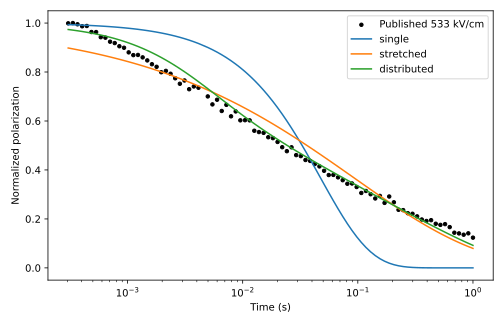
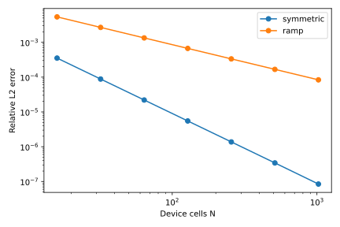

Integration verification
==========================

The integration was checked by executing all four archived notebooks and the
complete native campaign, then comparing their outputs. The numerical record
is stored under ``validation/``. These checks establish migration fidelity;
they are not additional experimental validation.

Recorded checks
-----------------

* 24 package tests passed, including direct original-function generator parity,
  calibration holdout separation, analytic Jacobian finite differences,
  structural forces, detailed balance, positivity, mass conservation, and
  the distinction between mesh-parity and smooth-limit runs.
* Four complete source notebooks executed successfully.
* The original v3.1 internal audit passed 80 of 80 gates.
* All 22 recorded migration comparisons passed, including the five extra
  parameter-profile intervals and all 16 retrospective field/model RMSEs.
* All 100 calibration bootstrap refits converged.

.. list-table:: Reproduced numerical targets
   :header-rows: 1

   * - Quantity
     - Native result
   * - Primary 533 kV/cm holdout RMSE
     - 0.0263372453
   * - Primary holdout R²
     - 0.9908061998
   * - Spectrum slope alpha_A
     - 6.52887
   * - Original accepted-grid alpha interval
     - [5.85566, 7.42649]
   * - Constant-D matched-generator order
     - 2.02908
   * - R3 symmetric-background order
     - 2.00309
   * - R3 gradient-background order
     - 1.00164

Re-run parity verification
----------------------------

.. code-block:: bash

   poetry run proton-study --study all --output paper_results
   poetry run proton-reference --output reference_results
   poetry run python scripts/verify_migration.py \
       --native paper_results --reference reference_results \
       --output validation/migration.json

The comparison script records residuals and tolerances and exits nonzero on a
failed comparison. Tiny optimizer and eigensolver differences are expected
across numerical-library versions; bitwise identity is not asserted for
refitted parameters, compressed archives, or rendered PDFs.

The source notebook terminology is preserved in reference outputs. The current
model documentation takes precedence when describing physical scope.
